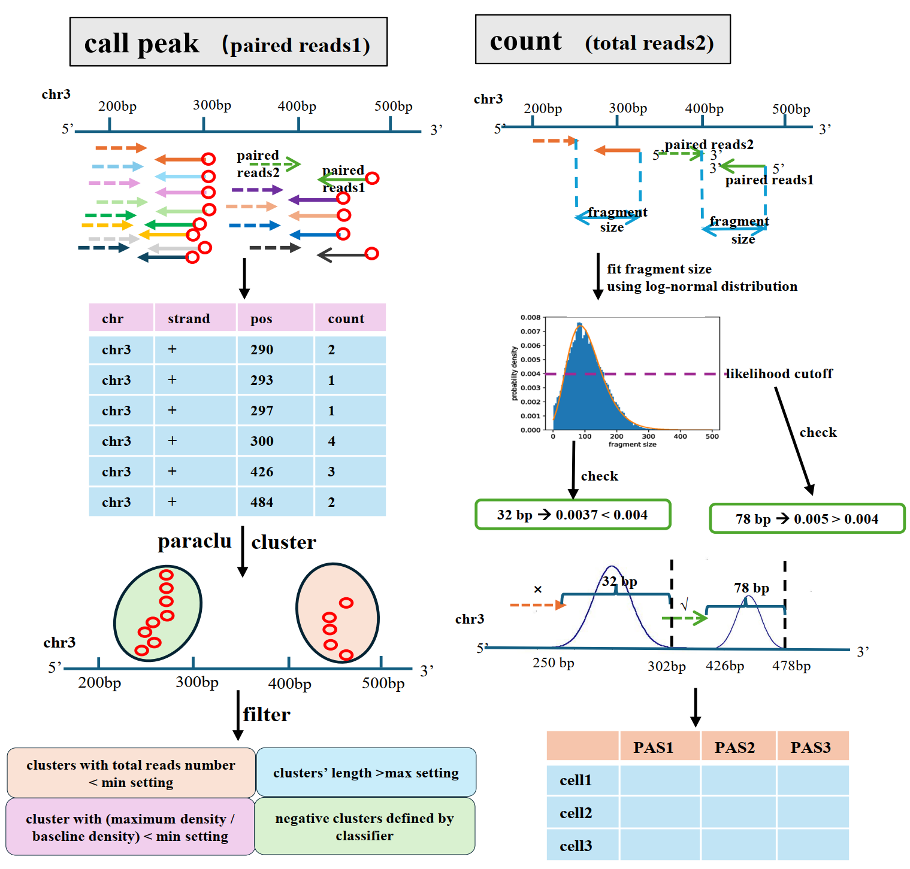

|PyPI| |Docs| 

.. |PyPI| image:: https://badge.fury.io/py/scTail.svg
       :target: https://pypi.org/project/scTail/0.0.1/
.. |Docs| image:: https://readthedocs.org/projects/sctail/badge/?version=latest
      :target: https://sctail.readthedocs.io/en/latest/?badge=latest

====
Home
====

About scTail
==================

scTail can  precisely identify polyadenylation site by using cDNA on reads 1 and quantify its expression by leveraging the cDNA on read 2, which enables effective detection of alternative PAS usage. 

Based on development dogama metioned above, please check your reads1 (the one that contains cellbarcode and UMI) at first before you run scTail to make sure the length of it more than 100bp. In the most situations, it is perfect that length of reads 1 is 150bp or 151bp.  

scTail only support two species: mouse and human. Because classifier embedded in it only trains with sequence of mouse and human.

scTail detect and quantify PAS through three steps: **scTail-callPeak** **scTail-peakMerge** **scTail-count**. scTail can play with big bam file. If one of your bam file is too large (more than 30G), you can split them into small bam file to make sure running scTail fastly. 

scTail identify PAS through the following steps.

Specificlly, a convolutional neural network was applied to filter out false positive peaks.

It includes 3 steps to identify alternative PAS usage: preprocessing, running scTail and running BRIE2.

Please refer to our tutorial for details.

* `Preprocess for sample with small size (bam file < 30G) or large size (bam file > 30G), respectively`_.

* `Run scTail`_.

* `Run BRIE2`_.

.. _Preprocess for sample with small size (bam file < 30G) or large size (bam file > 30G), respectively: ./preprocess.rst

.. _Run scTail: ./run_scTail.rst

.. _Run BRIE2: ./runBRIE.ipynb

.. toctree::
   :caption: Main
   :maxdepth: 1
   :hidden:

   index   
   install
   preprocess
   run_scTail
   runBRIE.ipynb
   release
